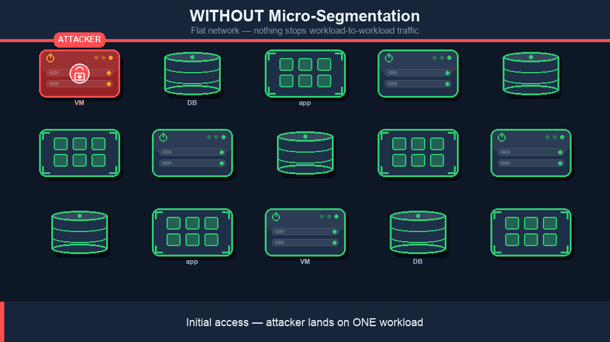
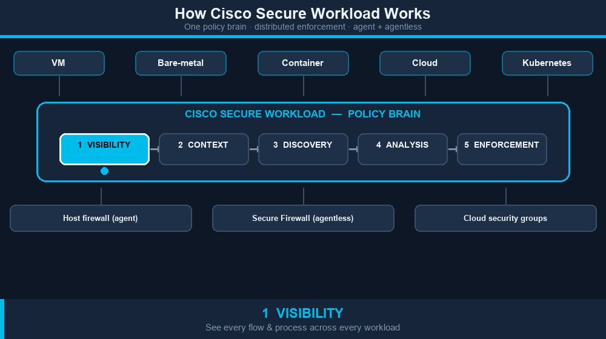

# Cisco Secure Workload — User Education


**A practical, vendor-neutral learning path for understanding and explaining Cisco Secure Workload (CSW).**

> **Disclaimer:** This repository is **not** official Cisco product documentation. It is companion learning material maintained for customer and partner education. Always validate design, scope, and supported features against your tenant's in-product documentation and [Cisco Secure Workload product documentation](https://www.cisco.com/c/en/us/products/security/workload-security/index.html) before production decisions.
>
> **Video attributions:** All videos linked in this repository are the property of their respective creators and channels. Full credit to:
> - **Jason Maynard** — ["How Hard Can It Be?" CSW series](https://www.youtube.com/@jasonmaynard8773) and the [Cisco Secure Workload deep-dive playlist](https://www.youtube.com/playlist?list=PLyf18hdY22ESRYAoYLcJaehao1W8y9XFv) (Modules 1–8, and deep-dive content in Modules 3, 5, 6, 7, 11, 13, 16)
> - **Jorge Quintero, Jason Lunde & Amandeep Singh** (Cisco TMEs) — [Cisco Secure Workload official YouTube channel](https://www.youtube.com/@ciscosecureworkload) (Modules 9–15)
> - **BarrySecure** — [BarrySecure YouTube channel](https://www.youtube.com/@BarrySecure) (CSW 101 overview demo)
>
> This repo curates and organizes their publicly available content into a structured learning path. No content has been reproduced or modified — all links go directly to the original videos.

Cisco Secure Workload is a workload visibility and micro-segmentation platform. It discovers how applications communicate, turns that into label-based policy, and lets teams roll out least-privilege segmentation across data centers, public cloud, containers, and supported workload environments — without breaking the apps. This repo gives you everything you need to learn it: a written guide (Markdown / Word / PDF), a curated **84-entry** video catalog with direct links, an onboarding runbook, and discovery and evidence checklists for POVs.

> **In one sentence:** CSW exists so that when — not if — one workload is compromised, the attacker cannot reach the next one.

## Contents

- [Who This Repo Is For](#who-this-repo-is-for)
- [The Problem CSW Solves](#the-problem-csw-solves)
- [How Cisco Secure Workload Works](#how-cisco-secure-workload-works)
- [Micro-segmentation Is a Journey](#micro-segmentation-is-a-journey)
- [Phased Adoption Roadmap](#phased-adoption-roadmap)
- [Quick Start: Where to Begin](#quick-start-where-to-begin)
- [Video Library (Learning Path Order)](#video-library-learning-path-order)
- [Repository Layout](#repository-layout)
- [Regenerating the Documents](#regenerating-the-documents)
- [Step-by-Step Guides](#step-by-step-guides)

## Who This Repo Is For

- **Customers and partners** evaluating or onboarding CSW.
- **Cisco SEs, account teams, and delivery teams** who need a consistent way to explain CSW and run a POV.
- **Security, network, and platform engineers** who want a practical learning path without wading through release notes and product docs.

It is intentionally vendor-neutral in tone — no specific customer names, no marketing fluff — so it can be reused across deals and engagements.

## The Problem CSW Solves

Cisco Secure Workload exists to break the assumption that an attacker who gets inside the network can move freely. Most enterprise networks are still relatively flat at the workload layer — once one server is compromised through a phishing link, an exposed admin port, a vulnerable web app, or a stolen credential, the attacker can usually reach hundreds of other servers, file shares, and databases over the same internal network paths that legitimate applications use.

CSW reduces the **blast radius** of an intrusion by limiting each workload to **only the communication it actually needs**, based on real observed application behavior.

### The Lateral Movement Problem

After initial access, modern attackers (and most ransomware operators) follow a predictable pattern:

1. Land on one workload — phishing, exposed RDP/SSH, exploited service, supply chain.
2. Discover the internal network — port scans, SMB enumeration, AD reconnaissance.
3. Steal credentials — Mimikatz, LSASS dumps, Kerberoasting.
4. Move laterally — RDP, SMB, WinRM, WMI, PsExec, SSH, RPC, lateral admin tools.
5. Escalate to high-value targets — domain controllers, backup servers, file servers, databases, hypervisors.
6. Stage and detonate payload — ransomware, data exfiltration, destruction.

Visually, here is the difference CSW makes — the *same* ransomware attack **without** micro-segmentation (it fans out and encrypts the whole estate) versus **with** Cisco Secure Workload (the breach is contained to the one workload the attacker landed on):



> **What the animation shows:** CSW intervenes between **steps 4 and 5** of the kill chain. Least-privilege policy removes the workload-to-workload network paths that recon, credential theft, lateral movement, and privilege escalation all depend on. The attacker can still land on host 1, but cannot reach hosts 2..N from there — so the blast radius is a single workload instead of the entire data center.

**Steps 2 through 5 all depend on the network allowing workload-to-workload traffic that no business application actually requires.** That is exactly the layer CSW controls.

### How CSW Stops or Slows Ransomware

Ransomware groups make money by encrypting many systems in a short time window. They depend on:

- Unrestricted **SMB / file share access** between workstations and servers.
- Open **RDP / WinRM / WMI / PsExec** paths between servers.
- Reachable **backup servers, file servers, and hypervisors** from compromised endpoints.
- Free **outbound east-west traffic** that lets the malware fan out.

CSW directly attacks every one of those preconditions:

| Ransomware behavior | What CSW does about it |
|---|---|
| SMB / RDP / WinRM fan-out from a compromised workload | Allow only application-required ports between specific workload groups; deny lateral admin protocols by default. |
| Mass file-share encryption | Restrict file-server access to the specific workloads / users / processes that genuinely need it. |
| Reaching backup or recovery systems | Place backup servers in their own scope; permit traffic only from backup agents, not general workloads. |
| Reaching domain controllers / identity tier | Scope identity / AD tier so only required clients and admin jump hosts can reach it. |
| Hopping between application tiers | Enforce per-app and per-tier policy (web → app → db) so a compromised web tier cannot reach unrelated databases. |
| Spreading to dev / test / lab | Hard-segment prod from non-prod so a non-prod compromise cannot pivot into prod. |
| Long undetected dwell time | Surface every blocked or anomalous flow as evidence for SOC and incident response. |

The result is that **ransomware that lands on one workload finds the network around it almost empty**: the protocols it needs to spread are blocked by policy, and every attempt is logged.

### Why We Need It

- **Flat networks no longer match the threat model.** Perimeter firewalls do not stop an attacker who is already inside.
- **Identity-based and EDR controls are necessary but not sufficient.** They catch behavior on the host; CSW removes the network paths the attacker would use between hosts.
- **Crown-jewel applications need explicit protection.** Payments, claims, customer data, intellectual property, and backup infrastructure should not be reachable from a random user workstation or low-tier dev server.
- **Compliance and audit demand it.** PCI, HIPAA, SOX, and most internal security frameworks expect documented segmentation between regulated and non-regulated systems. For framework-by-framework mappings — customer-facing reports and matching SA / SE technical runbooks across HIPAA, SOC 2, PCI DSS v4, NIST 800-53, ISO 27001:2022, CISA ZTMM, FIPS 140, NIST 800-207 / 207A, DORA, NIS2, NERC CIP, TSA Pipeline, CIS Controls v8.1, NIST CSF 2.0, CMMC 2.0, and more — see the companion repository: **[chandrapati/CSW-Compliance-Mapping](https://github.com/chandrapati/CSW-Compliance-Mapping)**. Use it whenever a customer asks "how does CSW map to *&lt;framework&gt;*?". For Epic EHR tier microsegmentation (Hyperspace, Clarity, Caboodle, Mirth, and related tiers), see **[chandrapati/CSW-Epic-Microsegmentation-Guide](https://github.com/chandrapati/CSW-Epic-Microsegmentation-Guide)**.
- **It must not break applications.** CSW's discovery-first model (map dependencies → label workloads → model policy → enforce in stages) is what makes segmentation finally feasible in real enterprises.

## How Cisco Secure Workload Works

CSW runs one repeatable pipeline — **see everything → add context → discover the policy → prove it's safe → enforce it everywhere** — driven from a single policy “brain” with distributed enforcement at the workload (agent), the network (Cisco Secure Firewall, agentless), and the cloud (security groups):



| Stage | What happens |
|---|---|
| **1 · Visibility** | Agents and connectors stream every flow and process across VM, bare-metal, container, cloud, and Kubernetes workloads. |
| **2 · Context** | Workloads are labeled from systems of record — CMDB, cloud tags, ISE, DNS — so policy is written in human terms, not IP addresses. |
| **3 · Discovery** | ADM + machine learning auto-discover application dependencies and propose least-privilege allow-list policy. |
| **4 · Analysis** | Policy is simulated and validated against live traffic so it won't break the application before enforcement. |
| **5 · Enforcement** | One policy is pushed everywhere: host OS firewall (agent), Cisco Secure Firewall (agentless), and cloud security groups. |

## Micro-segmentation Is a Journey

Micro-segmentation is **not** a one-time project you finish and archive. Applications change constantly — new services, refactors, cloud migrations, seasonal traffic, emergency patches, and M&A integrations all shift who talks to whom. A policy that was correct at go-live can be wrong six months later without anyone noticing.

CSW is built for that reality:

- **Continuous visibility** — agents and connectors keep observing flows and process context so dependency truth stays current, not frozen in last year's Visio diagram.
- **Discover change before you break production** — monitor and simulation modes surface new or unexpected conversations so teams can tune policy *before* enforcement blocks a legitimate transaction.
- **Policy that can adapt** — labels, scopes, ADM, and policy modeling let teams adjust allow rules when the application legitimately changes; vulnerability-driven tightening and forensics add another layer when risk spikes.
- **Operational discipline** — change windows, app-owner review, policy-as-code, label sync from CMDB/cloud tags, and drift detection (see CI/CD integration patterns below) are how mature programs keep segmentation aligned with the business over years, not weeks.

Treat the [phased adoption roadmap](#phased-adoption-roadmap) as a **starting path**, not an exit. Phase 5 (forensics, anomaly detection, SIEM integration) and day-2 practices in the onboarding runbook exist precisely because segmentation value compounds when it stays tied to how applications actually behave.

> **Plain language:** You are not buying a static rule set. You are standing up a **program** to see workload communication, govern change, and keep least-privilege policy matched to the apps you protect.

## Phased Adoption Roadmap

CSW value compounds in phases. You do **not** need to wait for full Application Dependency Mapping (ADM) to get value — each phase below delivers a concrete outcome on its own, and a customer who stops after Phase 2 has already shrunk ransomware blast radius and isolated prod from non-prod.


| Phase | Window | What you do | What you ship | Primary value |
|---|---|---|---|---|
| **1 — Visibility** | Week 0–2 | Deploy agents on a representative slice. Turn on cloud, CMDB, identity, and DNS connectors. Import existing labels. | Workload inventory, label dictionary, L3 / L4 + process flow data, baseline dependency view. | See what you actually have, with real flow truth — often the first time application owners can answer "who does this server talk to?". |
| **2 — Macro Segmentation** | Week 2–4 | Apply broad zone-to-zone policy in monitor mode, then enforcement: prod ↔ non-prod, prod ↔ dev / test / staging, user VLANs ↔ server zones. Deny lateral admin protocols (SMB, RDP, WinRM, WMI, PsExec, SSH) where no business app needs them. Isolate the backup tier and identity tier. | Enforced macro policy with monitor-mode evidence and rollback plan. | **Biggest blast-radius reduction for the lowest effort.** Ransomware fan-out paths are cut. The prod / non-prod story holds up in audit. High-value tiers (backup, AD, hypervisor) are reachable only from where they should be. |
| **3 — ADM + App-Scope Micro-Segmentation** | Week 4–12 (per application wave) | Run ADM on a chosen application. Review the dependency map with the app owner. Convert observed flows + labels into recommended allow rules. Move to monitor mode, tune, then staged enforcement. Repeat for the next app wave. | Per-app dependency map, modeled policy, blocked-flow evidence, allowed-business-transaction evidence, app-owner signoff. | True micro-segmentation around the application itself. Per-tier policy (web → app → db). App teams understand their own application, sometimes for the first time. |
| **4 — Vulnerability-Driven Risk Reduction** | Continuous from ~Week 8 | Ingest vulnerability data (scanner exports, CVE feeds). Tag workloads with risk labels (for example `risk:high`, `cve:exploitable`). Tighten policy automatically for high-risk workloads — restrict their reachable surface to admin / patch paths only until remediated. | Risk-tagged inventory, tightened policy on vulnerable workloads, security and audit evidence. | Defenders work the problems attackers actually try. When the next Log4J / Log4Shell-class CVE lands, exposure can be shrunk within the same day instead of waiting on patch cycles. |
| **5 — Forensics and Anomaly Detection** | Continuous from ~Week 8 | Use Secure Workload forensics events, flow-pattern anomaly detection, and SIEM / SOAR integration. Build playbooks that pair policy violations with host evidence. | Forensics events, anomaly findings, SOC playbooks, IR evidence trails. | Detection compounds with segmentation. Every blocked flow becomes evidence. Mean-time-to-detect drops because workload behavior is bounded by policy. |

**Key idea:** every phase is independently valuable. A customer who stops after Phase 2 still wins — ransomware fan-out is gone and prod is isolated from non-prod. A customer who reaches Phase 5 has continuous defense in depth — and should keep operating there, because [applications and policy both keep changing](#micro-segmentation-is-a-journey).

### Mapping phases to videos in the catalog

- **Phase 1 — Visibility:** Agent Configuration Profile, Scopes, Labels, Inventory Filters, Flow Analysis.
- **Phase 2 — Macro Segmentation:** SSH Risk Reduction, Terminal Services Segmentation, Production and Test Risk Reduction, VDI Segmentation.
- **Phase 3 — ADM + App-Scope Micro:** Application Dependency Mapping & Policy Analysis, Policy Visual and Quick Analysis, Dynamic Workloads & Policy, AI-Driven Policy Suggestions, Policy Statistics with AI Engine.
- **Phase 4 — Vulnerability-Driven Risk Reduction:** Vulnerabilities and Risk Reduction, Log4J Risk Reduction, Security Dashboard.
- **Phase 5 — Forensics and Anomaly Detection:** Forensics, Flow Analysis, Security Dashboard.

The tactical, step-by-step deployment playbook (tenant prep, agent rollout, label strategy, policy modeling, enforcement testing, operationalization) lives in **§ 8 CSW Onboarding Runbook** of [`docs/user-education/CSW-User-Education-Guide.md`](docs/user-education/CSW-User-Education-Guide.md).

## Quick Start: Where to Begin

Pick the lane that matches your time and role.

| If you have... | Start with |
|---|---|
| **10 minutes** | [🎬 Scopes](https://www.youtube.com/watch?v=3KBmanCNm4U) and [🎬 Labels](https://www.youtube.com/watch?v=NLoZq0wiTU8) — the two foundational concepts every CSW conversation builds on. |
| **30 minutes** | Add [🎬 Application Dependency Mapping & Policy Analysis](https://www.youtube.com/watch?v=Jzzblea25UA) — the primary value of CSW: discover what talks to what, then derive policy. |
| **2 hours** | Modules 1–4 in the [Video Library](#video-library-learning-path-order) (foundations through core policy workflow). |
| **A POV is on the table** | Skim Core CSW Training, watch [🎬 Production and Test Risk Reduction](https://www.youtube.com/watch?v=HKT18Ylt4IY) plus the integration videos that match the customer stack (firewall, F5, ISE, FMC). Then open [`docs/user-education/CSW-User-Education-Guide.md`](docs/user-education/CSW-User-Education-Guide.md) for the onboarding runbook and POV evidence checklist. |
| **Secure Firewall + NetFlow in scope** | Start with [📘 **CSW-Secure-Firewall-Integration-Guide**](https://github.com/chandrapati/CSW-Secure-Firewall-Integration-Guide) — step-by-step NSEL ingest and FMC enforcement with linked YouTube videos. |
| **Healthcare / Epic EHR POV** | Open [📘 **CSW-Epic-Microsegmentation-Guide**](https://github.com/chandrapati/CSW-Epic-Microsegmentation-Guide) — phased Epic tier microsegmentation playbook (visibility → policy → enforcement → operations). |

## Video Library (Learning Path Order)

> **Legend:** 🎬 video · 📘 guide · 📄 doc

**84 curated videos across 16 modules**, ordered so CSW skills build fastest: concepts → agents → visibility → policy → security outcomes → environment-specific depth. To keep this README scannable, the **full catalog now lives on its own page**.

### ▶ [Open the full Video Library →](docs/user-education/VIDEO-LIBRARY.md)

**New to CSW? Start here:**

| Video | Description |
|---|---|
| [🎬 Cisco Secure Workload — Overview & Live Demo](https://www.youtube.com/watch?v=8v6BQYrO5v8&t=2s) | End-to-end product walkthrough — best first watch before any module. |

**Module index** — jump straight into the catalog:

| Module | Topic |
|---|---|
| [Module 1](docs/user-education/VIDEO-LIBRARY.md#module-1--foundations-start-here) | Foundations (start here) |
| [Module 2](docs/user-education/VIDEO-LIBRARY.md#module-2--agent-deployment) | Agent deployment |
| [Module 3](docs/user-education/VIDEO-LIBRARY.md#module-3--visibility-and-dependency-discovery) | Visibility and dependency discovery |
| [Module 4](docs/user-education/VIDEO-LIBRARY.md#module-4--ai-assisted-policy-after-module-3) | AI-assisted policy (after Module 3) |
| [Module 5](docs/user-education/VIDEO-LIBRARY.md#module-5--security-risk-and-forensics) | Security, risk, and forensics |
| [Module 6](docs/user-education/VIDEO-LIBRARY.md#module-6--segmentation-use-cases) | Segmentation use cases |
| [Module 7](docs/user-education/VIDEO-LIBRARY.md#module-7--integrations-pick-what-matches-the-stack) | Integrations (pick what matches the stack) |
| [Module 8](docs/user-education/VIDEO-LIBRARY.md#module-8--containers-and-kubernetes) | Containers and Kubernetes |
| [Module 9](docs/user-education/VIDEO-LIBRARY.md#module-9--official-channel-getting-started) | Official Channel: Getting Started |
| [Module 10](docs/user-education/VIDEO-LIBRARY.md#module-10--connectors-telemetry--application-discovery) | Connectors, Telemetry & Application Discovery |
| [Module 11](docs/user-education/VIDEO-LIBRARY.md#module-11--policy-lifecycle--enforcement-deep-dive) | Policy Lifecycle & Enforcement (deep dive) |
| [Module 12](docs/user-education/VIDEO-LIBRARY.md#module-12--security-forensics--alerting) | Security, Forensics & Alerting |
| [Module 13](docs/user-education/VIDEO-LIBRARY.md#module-13--day-2-operations--platform-management) | Day-2 Operations & Platform Management |
| [Module 14](docs/user-education/VIDEO-LIBRARY.md#module-14--integrations-newer) | Integrations (newer) |
| [Module 15](docs/user-education/VIDEO-LIBRARY.md#module-15--strategy--architecture) | Strategy & Architecture |
| [Module 16](docs/user-education/VIDEO-LIBRARY.md#module-16--incident-response-ir-deep-dive) | Incident Response (IR Deep Dive) |

## Repository Layout

| Path | What it is |
|---|---|
| [`README.md`](README.md) | This file: intro, value story, and a compact video-library module index. |
| [`docs/user-education/VIDEO-LIBRARY.md`](docs/user-education/VIDEO-LIBRARY.md) | Full 84-video catalog (16 modules) in learning-path order. |
| [`docs/user-education/CSW-User-Education-Guide.md`](docs/user-education/CSW-User-Education-Guide.md) | Full Markdown guide: intro, concepts, video library, onboarding runbook, discovery questions, POV evidence checklist, pitfalls, talk track. |
| [`docs/user-education/CSW-Secure-Firewall-Integration-Guide.md`](docs/user-education/CSW-Secure-Firewall-Integration-Guide.md) | Step-by-step Secure Firewall NSEL ingest + FMC enforcement integration with video links. |
| [`docs/user-education/CSW-User-Education-Guide.docx`](docs/user-education/CSW-User-Education-Guide.docx) | Generated Word version of the guide. |
| [`docs/user-education/CSW-User-Education-Guide.pdf`](docs/user-education/CSW-User-Education-Guide.pdf) | Generated PDF version of the guide. |

The Markdown files are the source of truth for the guide. The `.docx` and `.pdf` artefacts are regenerated from Markdown — see below.

## Regenerating the Documents

After editing either `README.md` or `CSW-User-Education-Guide.md`, rebuild the Word and PDF artefacts:

```bash
# Step 1 - Markdown to DOCX (fast, ~7s)
pandoc docs/user-education/CSW-User-Education-Guide.md \
  --from gfm \
  --to docx \
  --toc \
  --toc-depth=2 \
  -o docs/user-education/CSW-User-Education-Guide.docx

# Step 2 - DOCX to PDF (LibreOffice headless, ~35s)
# Use an isolated user profile so the build does not block
# on a stale lock if a LibreOffice GUI is open elsewhere.
cd docs/user-education
rm -rf /tmp/lo_csw_profile
soffice --headless \
  -env:UserInstallation=file:///tmp/lo_csw_profile \
  --convert-to pdf CSW-User-Education-Guide.docx
```

Keep the two steps separate (do not chain with `&&`): if `soffice` ever hangs on a profile lock, the DOCX is already on disk and you only need to retry the PDF step.

---

## Step-by-Step Guides

> **Legend:** 🎬 video · 📘 guide · 📄 doc

Hands-on integration and deployment guides — follow these top to bottom to build out a deployment:

| Guide | Description | Best for |
|-------|-------------|---------|
| [📘 Agent Installation](https://github.com/chandrapati/CSW-Agent-Installation-Guide) | Deploy CSW agents on Linux / Windows / cloud | Day-1 sensor deployment |
| [📘 Policy Lifecycle](https://github.com/chandrapati/CSW-Policy-Lifecycle) | Policy discovery → enforcement workflow | Policy management |
| [📘 ISE / pxGrid](https://github.com/chandrapati/csw-ise-integration) | ISE/pxGrid: user-identity–aware microsegmentation | Identity & Zero Trust |
| [📘 AnyConnect NVM](https://github.com/chandrapati/csw-anyconnect-nvm) | Endpoint process flows + user identity via NVM | Endpoint telemetry |
| [📘 ServiceNow CMDB](https://github.com/chandrapati/csw-servicenow-integration) | ServiceNow CMDB label enrichment for workload scopes | CMDB-driven policy |
| [📘 Infoblox](https://github.com/chandrapati/csw-infoblox-integration) | Infoblox IPAM/DNS extensible-attribute label enrichment | IPAM/DNS-driven policy |
| [📘 F5 BIG-IP](https://github.com/chandrapati/csw-f5-integration) | F5 virtual-server labels, policy enforcement, IPFIX flow visibility | Load balancer segmentation |
| [📘 NetScaler ADC](https://github.com/chandrapati/csw-netscaler-integration) | NetScaler LB virtual-server labels, ACL enforcement + AppFlow/IPFIX flow visibility | Load balancer segmentation |
| [📘 AWS Connector](https://github.com/chandrapati/csw-aws-connector) | EC2 tag ingestion + VPC flow logs + Security Group enforcement | AWS workloads |
| [📘 Azure Connector](https://github.com/chandrapati/csw-azure-connector) | Azure VM tag ingestion + VNet flow logs + NSG enforcement | Azure workloads |
| [📘 GCP Connector](https://github.com/chandrapati/csw-gcp-connector) | GCE label ingestion + VPC flow logs + firewall enforcement | GCP workloads |
| [📘 NetFlow](https://github.com/chandrapati/csw-netflow-integration) | NetFlow v9/IPFIX agentless flow ingestion from switches | Network fabric visibility |
| [📘 ERSPAN](https://github.com/chandrapati/csw-erspan-integration) | Agentless packet mirroring for legacy / OT / IoT devices | Deep agentless visibility |
| [📘 Secure Firewall](https://github.com/chandrapati/CSW-Secure-Firewall-Integration-Guide) | NSEL flow ingestion from Cisco Secure Firewall (FTD/ASA) | Firewall flow visibility |
| [📘 Splunk Integration](https://github.com/chandrapati/csw-splunk-integration) | CSW syslog alerts → Splunk SIEM | SecOps / SIEM teams |

## Resources

> **Legend:** 🎬 video · 📘 guide · 📄 doc

Learning paths, reference material, and day-2 tooling:

| Resource | Description | Best for |
|----------|-------------|---------|
| [📘 User Education](https://github.com/chandrapati/CSW-User-Education) | Onboarding guides, concept explainers, and curated video library | New CSW users |
| [📘 Compliance Mapping](https://github.com/chandrapati/CSW-Compliance-Mapping) | Map CSW controls to NIST, PCI-DSS, HIPAA, CIS | Compliance & audit |
| [📘 Tenant Insights](https://github.com/chandrapati/CSW-Tenant-Insights) | Tenant-level reporting and analytics | Visibility metrics |
| [📘 Operations Toolkit](https://github.com/chandrapati/CSW-Operations-Toolkit) | Day-2 ops scripts: health checks, reporting, policy analysis | Ongoing operations |
| [📄 Supported OS & Compatibility Matrix](https://www.cisco.com/c/m/en_us/products/security/secure-workload-compatibility-matrix.html) | Cisco's authoritative list of supported agent operating systems, external systems, and connector requirements | Platform planning & prerequisites |

> **Suggested customer journey:**
> User Education → Agent Installation → Policy Lifecycle → ISE/pxGrid → ServiceNow CMDB → Infoblox → F5 BIG-IP → NetScaler ADC → Splunk Integration → Compliance Mapping → Operations Toolkit
