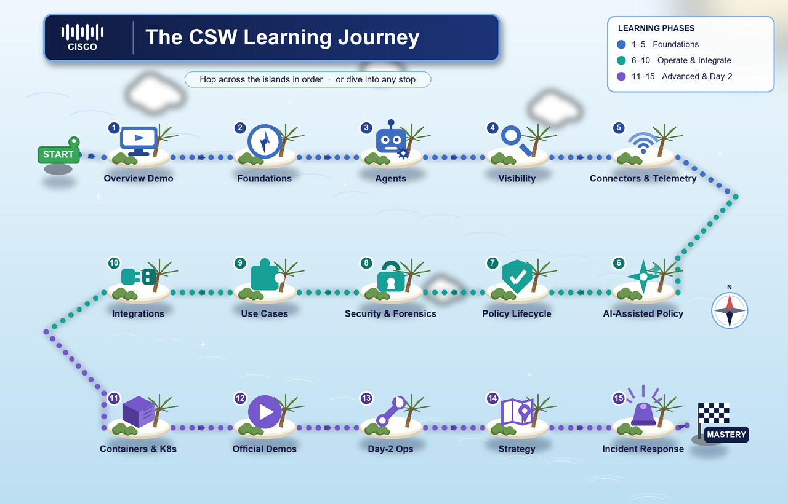

# Cisco Secure Workload — Video Library (Learning Path Order)

[← Back to the User Education README](../../README.md)

> **Legend:** 🎬 video · 📘 guide · 📄 doc

84 videos and references arranged in the order that builds CSW skills fastest: concepts first, then agents, then visibility → policy, then security outcomes, then environment-specific depth. Modules 1–8 are the original learning-path series; **Modules 9–15 add the newer official Cisco Secure Workload channel demos (2025–2026)**; **Module 16 covers Incident Response scenarios**. **Watch top to bottom** within each module; skip modules that do not match your POV (for example, skip Module 2 VDI if you are not deploying to golden-image desktops).

---

### Start Here — CSW 101 Introduction

> **New to Cisco Secure Workload? Watch this first.**
> A complete product overview and end-to-end live demo — covers what CSW is, how it discovers application dependencies, and how it enforces least-privilege policy.

| Video | Description |
|---|---|
| [🎬 Cisco Secure Workload — Overview & Live Demo](https://www.youtube.com/watch?v=8v6BQYrO5v8&t=2s) | End-to-end product walkthrough — what CSW does, how it works, and why it matters. Best first watch before any module below. |

---

### Module 1 — Foundations (start here)

Learn how CSW organizes workloads before any policy work.

| Video | Description |
|---|---|
| [🎬 Cisco Secure Workload: Scopes](https://www.youtube.com/watch?v=3KBmanCNm4U) | Group workloads logically for policy application and management. |
| [🎬 Cisco Secure Workload: Labels](https://www.youtube.com/watch?v=NLoZq0wiTU8) | Tag workloads for granular policy enforcement and visibility. |
| [🎬 Cisco Secure Workload: Inventory Filters](https://www.youtube.com/watch?v=fJd6V15UiZM) | Filter inventory to focus on specific workloads or groups. |

### Module 2 — Agent deployment

Roll out telemetry collection on workloads.

| Video | Description |
|---|---|
| [🎬 Cisco Secure Workload: Agent Configuration Profile](https://www.youtube.com/watch?v=4mFriUr4WHk) | Configure agent profiles to manage workload agents for security enforcement. |
| [🎬 Agent Configuration and Deployment – Golden Image VDI](https://www.youtube.com/watch?v=LYHnU_QjKfI) | Deploy agents in VDI environments using golden images. *Skip if VDI is not in scope.* |
| [🎬 Windows Deep Visibility Agent Install](https://www.youtube.com/watch?v=Nsju3KePVtc) | Step-by-step Windows agent installation for deep visibility and enforcement. |

### Module 3 — Visibility and dependency discovery

See what talks to what — the core CSW value story.

| Video | Description |
|---|---|
| [🎬 Production and Test Risk Reduction](https://www.youtube.com/watch?v=HKT18Ylt4IY) | Macro-segment prod vs non-prod — fast blast-radius win. |
| [🎬 Flow Analysis](https://www.youtube.com/watch?v=Tuw06kPjeyQ) | Understand traffic patterns and anomalies from observed flows. |
| [🎬 Application Dependency Mapping & Policy Analysis](https://www.youtube.com/watch?v=Jzzblea25UA) | Map application dependencies and derive microsegmentation policy. |
| [🎬 Dynamic Workloads & Policy](https://www.youtube.com/watch?v=Aajlx7JT2G4) | Adapt policy as workloads move or scale. |
| [🎬 Policy Visual and Quick Analysis](https://www.youtube.com/watch?v=uBxrJaVLHy4) | Visualize and analyze policy impact before enforcement. |
| [🎬 Manual Inventory Upload (Tagging)](https://www.youtube.com/watch?v=b5cegbbA3UM) | Bulk-upload and tag workload inventory when agents are not yet deployed. |
| [🎬 Application Dependency Mapping Discovery](https://www.youtube.com/watch?v=PZ4wNulQVek) | Run first-pass ADM to surface all application communication flows. |
| [🎬 Application Dependency Mapping Drilling into Policies](https://www.youtube.com/watch?v=NsGuQiooziY) | Deep-dive into ADM results: drill flows into policy rules. |

### Module 4 — AI-assisted policy (after Module 3)

Accelerate policy creation once the manual workflow is clear.

| Video | Description |
|---|---|
| [🎬 AI-Driven Policy Suggestions](https://www.youtube.com/watch?v=UwUJnEMZoTk) | AI-generated policy recommendations from observed behavior. |
| [🎬 Policy Statistics with Cisco Workloads AI Engine](https://www.youtube.com/watch?v=kvnAoT5ZYXl) | Policy statistics, anomalies, and tuning insights at scale. |

### Module 5 — Security, risk, and forensics

Operationalize risk reduction and incident evidence.

| Video | Description |
|---|---|
| [🎬 Security Dashboard](https://www.youtube.com/watch?v=_faK3p9tN4A) | Posture, risk indicators, and drill-downs. |
| [🎬 Vulnerabilities and Risk Reduction](https://www.youtube.com/watch?v=l7LwZHXBYUA) | Prioritize and reduce exposure on vulnerable workloads. |
| [🎬 SSH Risk Reduction](https://www.youtube.com/watch?v=RV7To1MF6Es) | Control SSH paths between workloads. |
| [🎬 Log4J Risk Reduction](https://www.youtube.com/watch?v=FTXsWtFUJZM) | Identify and contain Log4Shell-class exposure. |
| [🎬 Forensics](https://www.youtube.com/watch?v=ZPBcj4e6M34) | Process and flow evidence for investigations. |
| [🎬 Software Vulnerability and Adaptive Policy](https://www.youtube.com/watch?v=MSJcNB2xtBk) | Automatically tighten policy for vulnerable workloads using CVE data. |
| [🎬 Vulnerabilities Dashboard](https://www.youtube.com/watch?v=29-S5hl4g7M) | Explore the vulnerability dashboard: CVSS scores, workload exposure, and risk reduction. |

### Module 6 — Segmentation use cases

Deep dives when the customer environment matches.

| Video | Description |
|---|---|
| [🎬 Terminal Services Segmentation](https://www.youtube.com/watch?v=pfv42g3FJEk) | Segment RDS / Terminal Services environments. |
| [🎬 VDI Segmentation](https://www.youtube.com/watch?v=SFVjiPQFsYA) | Segment shared golden-image VDI estates. |
| [🎬 Security Mandate: Secured SSH Access](https://www.youtube.com/watch?v=CEIt5LZ0_98) | Enforce SSH access control across IT and SecOps workloads using policy mandates. |
| [🎬 Shared Services Mandate: Time Services](https://www.youtube.com/watch?v=sPHxgp65Ols) | Allow NTP/time services to all datacenter resources while blocking everything else. |
| [🎬 Web Services Mandate: Prod/Test Isolation](https://www.youtube.com/watch?v=xu78UvPXbMw) | Enforce that production and test environments cannot communicate. |
| [🎬 Retail Web Services Mandate: Limit Web Access](https://www.youtube.com/watch?v=i9EI9FpuDeE) | Restrict outbound web access for retail workloads using scoped mandates. |
| [🎬 Deep Dive Segmentation](https://www.youtube.com/watch?v=8zcKVLJQuzw) | Advanced segmentation walkthrough: absolute policy, catch-alls, and enforcement tuning. |

### Module 7 — Integrations (pick what matches the stack)

Watch only the rows relevant to the customer POV.

| Video | Description |
|---|---|
| [🎬 Secure Workload & Firewall Integration (Part 1)](https://youtu.be/vdHjAl48SuI) | Introduction, design, and architecture. |
| [🎬 Secure Workload & Firewall Integration (Part 2)](https://www.youtube.com/watch?v=xpbg3s0vrcI) | Deployment patterns and policy flow. |
| [🎬 Secure Workload & Firewall Integration (Part 3)](https://www.youtube.com/watch?v=X65mwN7kJGg&t=53s) | Enforcement, telemetry, and operations. |
| [📄 Secure Workload and Secure Firewall White Paper](https://www.cisco.com/c/en/us/products/collateral/security/secure-workload/sec-workload-firewall-wp.html) | Joint architecture reference (Cisco.com). |
| [📄 Secure Workload & Firewall Integration Deep Dive](https://secure.cisco.com/secure-workload/docs/secure-workload-whitepaper) | Design principles and use cases. |
| [🎬 F5 BIG-IP and Cisco Tetration: APM Visibility](https://www.youtube.com/watch?v=dqbWhvFNsso&t=90s) | F5 APM data for application visibility. |
| [🎬 Cisco Tetration and F5 BIG-IP AFM](https://www.youtube.com/watch?v=HcF3yQHmeXc) | F5 AFM flow context integration. |
| [🎬 F5 BIG-IP IPFIX Configuration](https://www.youtube.com/watch?v=aJZEcZtUXDg) | Send IPFIX from BIG-IP into Secure Workload. |
| [🎬 DNS Server Integration](https://www.youtube.com/watch?v=hD0WpBRLCiM) | DNS context for flow attribution and policy. |
| [🎬 Infoblox Integration](https://www.youtube.com/watch?v=gdhMWviAZig) | Infoblox DNS / IPAM context in CSW. |
| [🎬 Algosec Integration](https://www.youtube.com/watch?v=FUyESTLLZE8) | Firewall-policy lifecycle alongside CSW. |
| [🎬 ISE (In Action)](https://www.youtube.com/watch?v=KUJfuuhP1dc) | User and device identity from Cisco ISE. |
| [🎬 FMC Integration with Edge / Ingest / Appliance](https://youtu.be/13AZ33dpCxU) | FMC through Edge, Ingest, and appliance paths. |
| [🎬 ACI and CSW Integration](https://www.youtube.com/watch?v=u7jh3Zw1hlg) | ACI fabric policy with workload segmentation. |
| [🎬 Splunk Integration (SIEM)](https://youtu.be/CRnkH9imTZk) | Three patterns: Cisco Security Cloud App for baseline dashboards/datasets, CSW → Splunk Syslog alerts, and Splunk-driven Python against the CSW API for arbitrary metadata. |
| [🎬 CI/CD Pipeline Integration](https://www.youtube.com/watch?v=0wsSA69ol0M) | Treat CSW like any other declarative system: labels, scopes, and policy live in git and reach the tenant through pipeline-driven API calls. |
| [🎬 Agentless with Firepower Threat Defence](https://www.youtube.com/watch?v=S9TFfvbiJdc) | Use FTD as an agentless telemetry source for workloads where agent install is not possible. |

**Splunk integration — three patterns at a glance:**

1. **Cisco Security Cloud App for Splunk** — install the Cisco-published Splunk app; it reaches back to CSW (and other Cisco Security products) to pull a baseline set of datasets and dashboards. Lowest-effort starting point.
2. **CSW → Splunk Syslog alerts** — configure CSW to push alarms/alerts to Splunk over Syslog so SOC sees policy violations, agent health events, and forensic signals alongside everything else they already index.
3. **Splunk → CSW API (Python)** — Splunk can launch Python against the CSW API, so anything the API exposes (inventory, scopes, labels, policies, enforcement state, vulnerabilities, flow summaries — everything except the raw flow data itself) can be pulled into Splunk and indexed, dashboarded, or alerted on. This is where the "sky is the limit" — any custom CSW API script becomes a Splunk-driven data feed.

**CI/CD pipeline integration — what it typically wires up:**

- **Policy-as-code** — intended scopes, labels, and policies live in git; a pipeline job calls the CSW API to apply them, so the tenant matches the repo and changes go through code review instead of console clicks.
- **Promotion across environments** — the same policy bundle is rolled forward from dev → staging → prod, starting in Monitor mode and only flipping to Enforce after the gating checks pass.
- **Label sync from upstream sources of truth** — CMDB / cloud-tag exports get normalized in CI and pushed into CSW so workload labels stay accurate without manual upkeep.
- **Drift detection** — a scheduled pipeline diffs live tenant state against the repo and opens a ticket when something was changed out-of-band.
- **Built on the same API surface as Pattern 3 of the Splunk integration above** — any Python you already have for CSW becomes a pipeline step.

**Cisco Secure Firewall (NSEL + FMC enforcement) — all the relevant videos are rows 20–24, 32, and 59 above.** For a full step-by-step guide covering NSEL ingest, FlexConfig, FMC connector, and enforcement validation, see [**CSW-Secure-Firewall-Integration-Guide**](https://github.com/chandrapati/CSW-Secure-Firewall-Integration-Guide) — the complete guide is also available locally at [`CSW-Secure-Firewall-Integration-Guide.md`](CSW-Secure-Firewall-Integration-Guide.md).

### Module 8 — Containers and Kubernetes

When Kubernetes is in scope.

| Video | Description |
|---|---|
| [🎬 Agent K8s](https://www.youtube.com/watch?v=h9PW25UhXKs) | Secure Workload agent in Kubernetes environments. |

### Module 9 — Official Channel: Getting Started

Newer overview content published directly on the [Cisco Secure Workload YouTube channel](https://www.youtube.com/@ciscosecureworkload) (2025–2026). Use these as the most current "start here" demos.

| Video | Description |
|---|---|
| [🎬 Introduction to Secure Workload & Overview Demo](https://youtu.be/8HpUkYXbHnw) | Current product overview and end-to-end demo from the official Cisco channel. |
| [🎬 Inventory Filters (channel version)](https://youtu.be/ymCB_PkFYcI) | Official-channel refresh of inventory filtering. |

### Module 10 — Connectors, Telemetry & Application Discovery

How CSW ingests context and discovers applications before policy work.

| Video | Description |
|---|---|
| [🎬 Connector Overview](https://youtu.be/H6QxuouzeC8) | What connectors do and how they enrich telemetry. |
| [🎬 Connector Deployment](https://youtu.be/H0as2ppS84Q) | Deploying connectors on the virtual appliances. |
| [🎬 Provided Services](https://youtu.be/2dGQ9winZwE) | Built-in services on the appliances. |
| [🎬 Basic Application Discovery](https://youtu.be/HGvtBonFiE4) | First-pass ADM to surface application dependencies. |
| [🎬 Enhancing Application Discovery](https://youtu.be/4wa7PiHGUnM) | Improve ADM fidelity with labels and context. |

### Module 11 — Policy Lifecycle & Enforcement (deep dive)

The full policy workflow from modeling through enforcement placement.

| Video | Description |
|---|---|
| [🎬 Policy Lifecycle](https://youtu.be/Cm-cUwRorDc) | End-to-end policy lifecycle overview. |
| [🎬 Policy Validation and Analysis](https://youtu.be/DgaZpQ0lnAI) | Validate and analyze policy before enforcing. |
| [🎬 Policy Ordering](https://youtu.be/fG1Kn1C7QRM) | How rule order affects enforcement outcomes. |
| [🎬 Policy Enforcement Overview](https://youtu.be/A8rOXQ-y4Cw) | How enforcement is applied across workloads. |
| [🎬 Where to Enforce](https://youtu.be/urFJyDERMFs) | Choosing the right enforcement point (host / network / cloud). |
| [🎬 Container Enforcement](https://youtu.be/6Z_y_keYyE0) | Enforce policy on containerized workloads. |
| [🎬 Windows Process-Level Enforcement](https://youtu.be/frhcPHXQkNw) | Process-aware enforcement on Windows hosts. |
| [🎬 Policy Analysis and Enforcement](https://www.youtube.com/watch?v=NUKFwkZfdug) | Analyse policy intent vs enforcement state; identify gaps before locking down. |
| [🎬 Quick Analysis and Absolute Policy](https://www.youtube.com/watch?v=UjdBrDLpmGg) | Use quick analysis to validate flows, then lock scope with absolute policy. |
| [🎬 Security Incident and Absolute Policy](https://www.youtube.com/watch?v=DVrswUyuplM) | Use absolute policy to contain a scope during an active security incident. |

### Module 12 — Security, Forensics & Alerting

| Video | Description |
|---|---|
| [🎬 Security Dashboard and Forensics](https://youtu.be/PVRkzWRAa08) | Combined posture, risk, and forensic evidence walkthrough. |
| [🎬 Alerting](https://youtu.be/RqM6vbDEDPc) | Configure and route CSW alerts. |

### Module 13 — Day-2 Operations & Platform Management

Operate, audit, and protect the CSW platform itself.

| Video | Description |
|---|---|
| [🎬 Agent Operations](https://youtu.be/EIqPiPgpDqc) | Manage and maintain deployed agents. |
| [🎬 Auditing](https://youtu.be/_5K62x49c_I) | Audit trails for changes and access. |
| [🎬 Data Backup and Restore](https://youtu.be/dVK0xe4RWh4) | Back up and restore tenant/cluster data. |
| [🎬 Federation](https://youtu.be/465loG3VlZE) | Multi-cluster federation for scale. |
| [🎬 Managing Secure Workload in Security Cloud Control](https://youtu.be/UVTkxaUJSHA) | SaaS management via Security Cloud Control (SCC). |
| [🎬 Global Visualization Updates](https://youtu.be/kGLEKRltV2M) | Visualization enhancements. |
| [🎬 Global Visualization (deep-dive)](https://www.youtube.com/watch?v=KRbnrk0ge_Q) | Detailed walkthrough of the global visualization view across all scopes. |
| [🎬 Reports](https://www.youtube.com/watch?v=sbpEz0pU-Wc) | Generate and schedule compliance and operational reports from CSW. |

### Module 14 — Integrations (newer)

| Video | Description |
|---|---|
| [🎬 Secure Workload & Secure Firewall Integration Updates](https://youtu.be/IEqbz44YvOQ) | Latest firewall integration updates (supersedes the 3-part series for current behavior). |

### Module 15 — Strategy & Architecture

Executive- and architecture-level framing for segmentation programs.

| Video | Description |
|---|---|
| [🎬 Campus and Zero Trust](https://youtu.be/hX9Q6IYcgXA) | Extend Zero Trust segmentation into the campus. |
| [🎬 Enabling Consistent Multi-Cloud Security, Forensics & IR](https://youtu.be/x-dMr3Kg4dg) | Consistent policy and IR across multi-cloud. |
| [🎬 How to Create a Comprehensive Zero Trust Strategy](https://youtu.be/1jvgXt906m8) | Building an end-to-end Zero Trust strategy. |
| [🎬 Modern-Day Risk Reduction in Healthcare: Prescriptive-Based Policy](https://www.youtube.com/watch?v=eYbojr_h5ic) | Industry use case — applying CSW prescriptive policy to reduce healthcare workload exposure. |

### Module 16 — Incident Response (IR Deep Dive)

Use CSW forensics, flow evidence, and MITRE ATT&CK–mapped scenarios to investigate and contain incidents. Watch when a breach or suspicious behavior is under investigation.

| Video | Description |
|---|---|
| [🎬 Incident Response: Network Traffic](https://www.youtube.com/watch?v=cqkPbdq0hzM) | Use CSW flow data and forensics to investigate suspicious network traffic during an incident. |
| [🎬 Incident Response: T1156 — Create User](https://www.youtube.com/watch?v=ggTtqyzXaMM) | Detect and investigate MITRE ATT&CK T1156 (local account creation) with CSW process forensics. |
| [🎬 Incident Response: T1552 — Unsecured Credentials](https://www.youtube.com/watch?v=z-8Lw5fMeNw) | Detect credential harvesting (T1552) using CSW process and flow evidence. |
| [🎬 Incident Response: Vulnerability RDP Client](https://www.youtube.com/watch?v=dmpt3zjqrME) | Investigate an RDP-based vulnerability exploitation attempt using CSW telemetry. |

> **Video credits:** All linked videos are the property of their respective creators — this repo organizes and links to their public content without modification.
> - **Jason Maynard** ([@jasonmaynard8773](https://www.youtube.com/@jasonmaynard8773)) — "How Hard Can It Be?" CSW series (Modules 1–8) and the [Cisco Secure Workload deep-dive playlist](https://www.youtube.com/playlist?list=PLyf18hdY22ESRYAoYLcJaehao1W8y9XFv) (additional content in Modules 3, 5, 6, 7, 11, 13, 16). His recent channel uploads have shifted toward Cisco Secure Access / SOC topics.
> - **Jorge Quintero, Jason Lunde & Amandeep Singh** — Cisco TMEs publishing on the official [Cisco Secure Workload channel](https://www.youtube.com/@ciscosecureworkload) (Modules 9–15). Use these for the most current product behavior.
> - **BarrySecure** ([@BarrySecure](https://www.youtube.com/@BarrySecure)) — Cisco security practitioner demos covering CSW and the broader Cisco security portfolio (CSW 101 intro).
